# TP sur la Sécurité des systèmes distribués Oauth2 OIDC Keycloak
## Application web de gestion de facture avec authentification Oauth2 OIDC Keycloak

## Stack technique
- Frontend: Angular 
- Backend: Spring Boot 
- Keycloak: 
- Base de données: H2

## Architecture de l'application
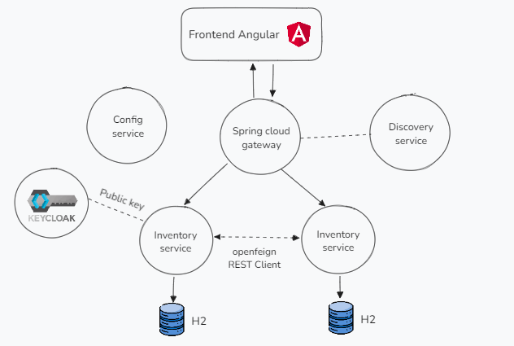

## Discovery Service
Le service de découverte est un service qui permet de découvrir les services disponibles dans l'application. Il est basé sur le protocole Eureka de Netflix. 
Il permet de centraliser les informations des services disponibles dans l'application.

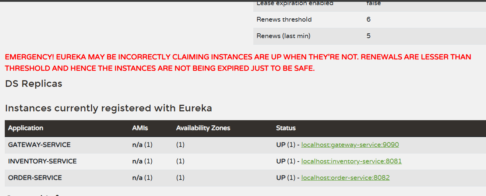

## Keycloak
Keycloak est un serveur d'authentification open source qui permet de gérer les identités et les accès des utilisateurs. Il implémente les protocoles Oauth2 et OpenID Connect.

## Configuration de Keycloak

### Starting Keycloak using Docker
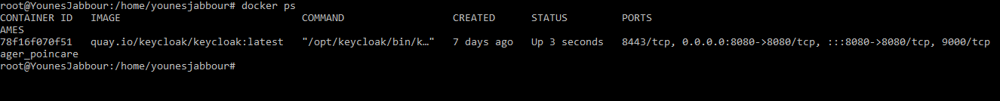

#### Création d'un realm
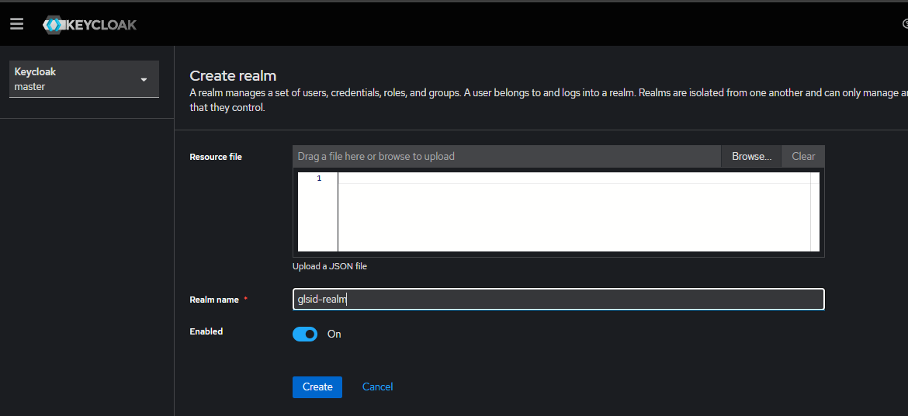

#### Création d'un client
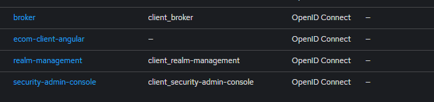

### L'ajout de la configuration dans chaque service ( inventory & Order )
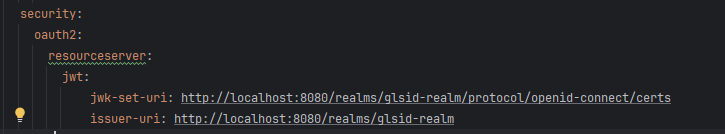

### Redirection vers Keycloak pour l'authentification
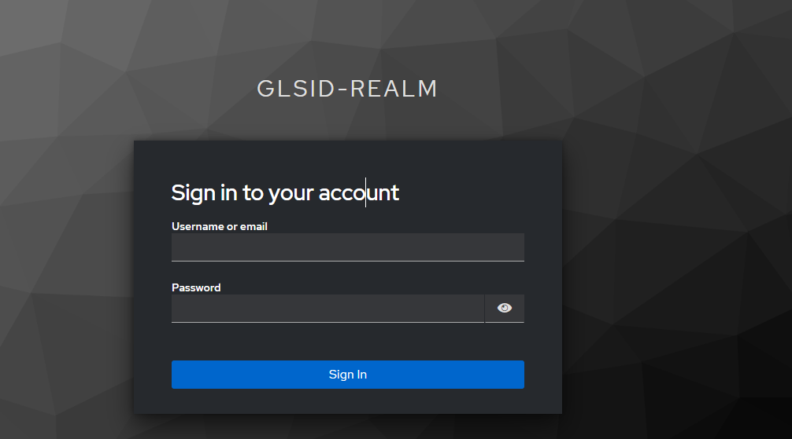

# Des apercus de l'application

### Page d'accueil
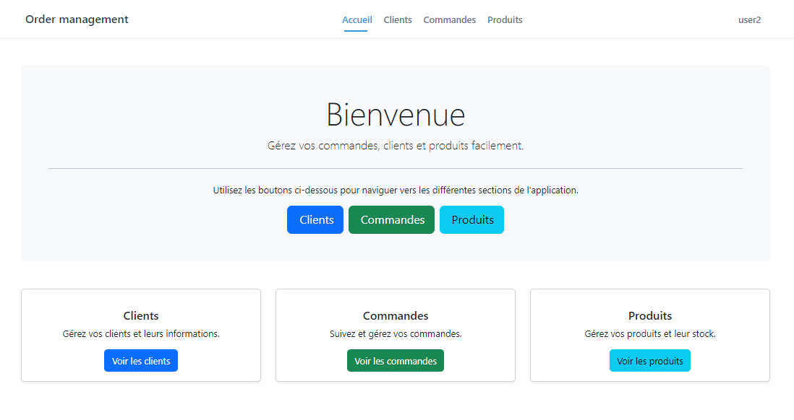

### Les commandes
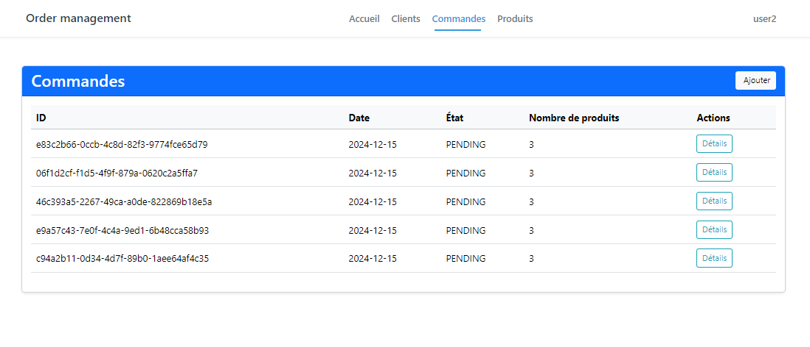

### Detail d'une commande
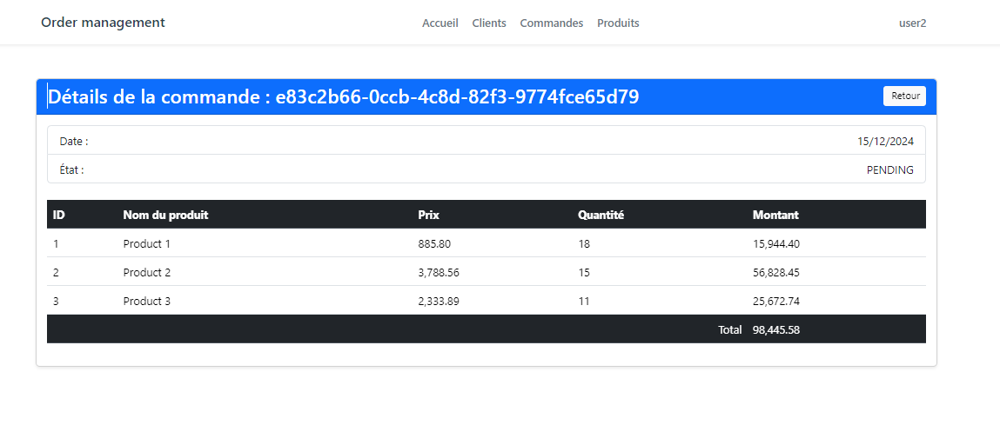

### Gestion des commandes
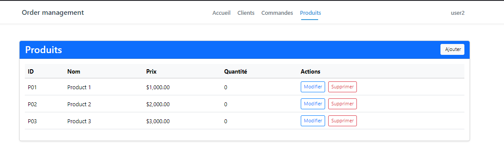

